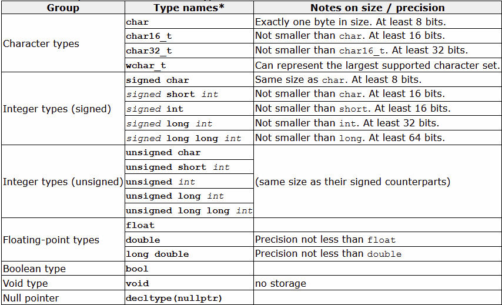

# Variables and Types

## Variables

**A variable is a container in which a data value is stored inside the physical memory.** Variables can be given names, these can be called identifiers, although the terms are interchangeable.

### Identifiers

A _valid identifier_ is a sequence of one or more letters, digits, or underscore characters \(_\). Spaces, punctuation marks, and symbols cannot be part of an identifier. Identifiers can also not start with a digit. Identifiers are also case specific, due to the nature of the_ C++.

### Identifier keywords

There are a number of keywords that an identifier cannot use to name a variable, however, compilers may have additional specific keywords. The general list looks something like this:

`alignas, alignof, and, and_eq, asm, auto, bitand, bitor, bool, break, case, catch, char, char16_t, char32_t, class, compl, const, constexpr, const_cast, continue, decltype, default, delete, do, double, dynamic_cast, else, enum, explicit, export, extern, false, float, for, friend, goto, if, inline, int, long, mutable, namespace, new, noexcept, not, not_eq, nullptr, operator, or, or_eq, private, protected, public, register, reinterpret_cast, return, short, signed, sizeof, static, static_assert, static_cast, struct, switch, template, this, thread_local, throw, true, try, typedef, typeid, typename, union, unsigned, using, virtual, void, volatile, wchar_t, while, xor, xor_eq`

## Data Type

A data type is a data storage format that can contain a specific type or range of values. This helps secruity of the program, legibility and is a defining feature of programming.

### Fundamental data types

Each data type tends to have a different size of maximum bits it can be assigned to, depending on the size it is allocated by the operating system. There are 4 main primitive data types:

* **Character types:** They can represent a single character, such as `'A'` or `'$'`. The most basic type is `char`, which is a one-byte character. Other types are also provided for wider characters.
* **Numerical integer types:** They can store a whole number value, such as `7` or `1024`. They exist in a variety of sizes, and can either be signed or unsigned, depending on whether they support negative values or not.
* **Floating-point types:** They can represent real values, such as `3.14` or `0.01`, with different levels of precision, depending on which of the three floating-point types is used.
* **Boolean type:** The boolean type, known in C++ as `bool`, can only represent one of two states, `true` or `false`.

Here is a graph that elaborates on sime of the sizes and types of the primitive data types



\*The Italics represent their full name, in a program you do not need the italics and the data type will be the exact same as it is with the italics, this is done through the compiler anyway even if you forget.

The **only** difference between the types is their size, being the amount of bits they occupy in the physical memory. Note how a lot of the data types only have a minimum size and not a maximum, meaning there is no standard size across all machines and compilers. This is to give C++ more flexibility to work on different platforms, both present and future.

Non primitive data types are strings, arrays, dictionaries and such.

### Declaration of variables

Every variable must be declared before use in C++. The syntax for declaring a variable is consistent with other programming languages, for example:

* `int a;`
* `float mynumber;`
* `int a, b, c;`
* `bool isActive;`

### Initialising variables

Variables can be declared in three ways in C++, which is best shown using a program, all of which are valid

```cpp
#include <iostream>
using namespace std;

int main ()
{
  // c-like initialization, [type identifier = initial_value;]
  int a=5;               // initial value: 5
  
  // constructor initialization, [type identifier (initial_value);]
  int b(3);              // initial value: 3
  
  // uniform initialization, [type identifier {initial_value};]
  int c{2};              // initial value: 2
  
  // initialization
  int result;            // initial value undetermined

  a = a + b;
  result = a - c;
  cout << result;

  return 0;
}
```

### Type deduction: auto and decltype

The compiler can also figure out the type of new fariables, using the `auto` type specifier, variables that are not initialized can also make use of type deduction with the `decltype` specifier, for example:

```cpp
int foo = 0;
auto bar = foo;  // the same as: int bar = foo;

int foo = 0;
decltype(foo) bar;  // the same as: int bar;
```

thus `bar`, has the same data type as `foo`. The point of these features is if you cannot obtain the type of the previous variable by other means, or when it improves legiblity. Although the examples shown are not good cases, they just show how the features work.

### Strings

The string class must be included in the header of your program to be used, and is used so you can use objects \(variables\) of the the type. The string class is a compiunt type, meaning that is used in the same way as a primitive data type is used, for example:



```cpp
#include <iostream>
#include <string>

using namespace std;

int main ()
{
  string mystring;
  mystring = "This is the initial string content";
  cout << mystring << endl;
  mystring = {"This is a different string content"};
  cout << mystring << endl;
  mystring = {"This is another string content"};
  cout << mystring << endl;
  return 0;
}
```



```
This is the initial string content
This is a different string content
This is another string content
```



NOTE: inserting the `endl` manipulator **end**s the **l**ine \(printing a newline character and flushing the stream\).

